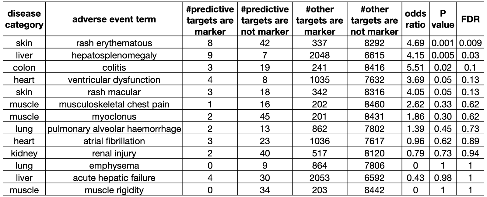

# The aim of this repository is to analyze the biological connections between targets and drug toxicity. 

## Introduction 

In the [TTox repository](https://github.com/yhao-compbio/TTox), we developed a feature selection pipeline that can identify target proteins predictive of drug toxicity. An advantage of our pipeline is that the identified targets can help explain explain cellular mechanisms underlying structure-toxicity associations. In this analysis, we uncovered the connections between identified targets and drug toxicity, thus demonstrated the significance of our feature selection results from a biological perspective. 

The codes to perform our analyses can be found in [`src/`](src/), along with detailed documentation.

## Results 

### Our pipeline can identify similar structure properties for target proteins of similar function

First, we evaluated the predictive molecular descriptors that our pipeline identified for target binding. Given there is no benchmarking standards connection descriptors to targets, we evaluated the results by checking whether similar descriptors are identified for targets of similar function. We grouped 377 target proteins (with model AUROC > 0.85) into six function classes: enzyme (35%), G-protein coupled receptor (23.6%), catalytic receptor (17.5%), nuclear hormone receptor (4.8%), ion channel (4.5%), transporter (3.2%). The pie chart below (on the left) shows the distribution of function classes. We computed pairwise Jaccard similarity of identified descriptors among targets, compared the similarity within and beyond each class. The boxplot below (on the right) shows the comparison. For G-protein coupled receptors and catalytic receptors, the intraclass similarity is significantly higher than the interclass similarity. Note that these two categories account for 41 percent of the targets we analyzed. 

We also mapped the targets to their Gene Ontology and Reactome pathway annotations. Detailed documentation about the annotations can be found at the [ontology repository](https://github.com/yhao-compbio/ontology). Again, we compared the similarity between target pairs with common function to those without common function. The boxplot below shows the comparison. We found that target pairs with common function are more likely to be identified with similar descriptors.  

### Identified target genes are differentially expressed in the tissue of toxicity 

Next, we analyzed the differential expression of target genes in the tissue of toxicity. For this analysis, we used GTEx tissue-specific TPM data. We normalized the expression values of each gene by the median expression across all tissues, then took the absolute value of logarithms as a measure of differential expression. We mapped 15 adverse events of interest (with model AUROC > 0.65) to a GTEx tissue, compared the differential expression of identified target genes to the null distribution consisting of all genes. The boxplot below shows the comparison. The identified target genes of seven adverse events are differentially expressed in their tissues of toxicity. They are: colitis (colon), renal injury (kidney), muscle rigidity (muscle), myoclonus (muscle), rash erythematous (skin), rash macular (skin), and pancytopenia (blood). 

## Identified target genes are enriched for disease markers/therapeutics

Last, we analyzed the connections between target genes and associated diseases. For this analysis, we used disease-gene connections from CTD. We only kept the connections with direct supporting evidence (e.g. the gene is a disease marker/therapeutic). We mapped 13 adverse events of interest (with model AUROC > 0.65) to a list of associated diseases through key words matching. We then tested whether the identified target genes are enriched for disease-related genes. The table below shows the results of Fisher's exact test. In six of the 12 adverse events, the identified target genes are twice or more likely to be disease-related genes (OR > 2). In two of the 12 adverse events, the identified target genes are significantly enriched for disease-related genes (FDR < 0.05). They are: rash erythematous-skin disease, and hepatosplenomegaly-liver disease. 

Detailed documentation about our results and figures can be found at [`data/`](data/) and [`plot/`](plot/), respectively.

## Conclusion
Through these analyses, we demonstrated that not only can our feature selection pipeline identify features predictive of the outcome, it can also identify features with biological significance. 

## References

+ Kumar RD, Chang LW, Ellis MJ, Bose R. Prioritizing potentially druggable mutations with dGene: an annotation tool for cancer genome sequencing data. PloS one. 2013 Jun 27;8(6):e67980.

+ Armstrong JF, Faccenda E, Harding SD, Pawson AJ, Southan C, Sharman JL, Campo B, Cavanagh DR, Alexander SP, Davenport AP, Spedding M. The IUPHAR/BPS Guide to PHARMACOLOGY in 2020: extending immunopharmacology content and introducing the IUPHAR/MMV Guide to MALARIA PHARMACOLOGY. Nucleic acids research. 2020 Jan 8;48(D1):D1006-21.

+ Wishart DS, Feunang YD, Guo AC, Lo EJ, Marcu A, Grant JR, Sajed T, Johnson D, Li C, Sayeeda Z, Assempour N. DrugBank 5.0: a major update to the DrugBank database for 2018. Nucleic acids research. 2018 Jan 4;46(D1):D1074-82

+ GTEx Consortium. The GTEx Consortium atlas of genetic regulatory effects across human tissues. Science. 2020 Sep 11;369(6509):1318-30.

+ Davis AP, Grondin CJ, Johnson RJ, Sciaky D, Wiegers J, Wiegers TC, Mattingly CJ. Comparative Toxicogenomics Database (CTD): update 2021. Nucleic Acids Research. 2021 Jan 8;49(D1):D1138-43.
